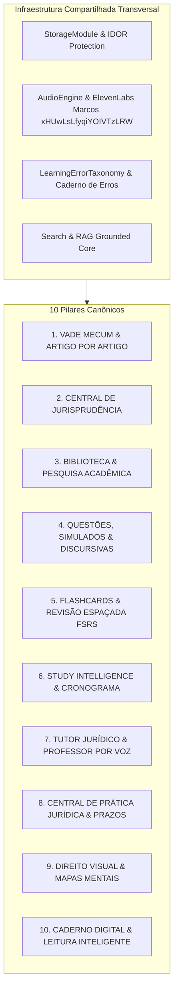

# 🏛️ Consolidação Arquitetural do VadeAudio AI (Architecture Consolidation)

Este documento registra a **consolidação e padronização arquitetural completa do VadeAudio AI**, integrando funcionalidades dispersas em **10 Grandes Pilares Canônicos**, eliminando redundâncias de código e menus, e unificando serviços transversais sob a regra: **100% de preservação funcional e zero perda de dados de usuário**.

---

## 🏛️ Os 10 Pilares Canônicos da Arquitetura

---

## 📊 Matriz de Consolidação (De $\rightarrow$ Para)

| Módulo / Etapa Anterior | Pilar Canônico | Módulo / Engine Canônica | Ganhos e Preservação |
| :--- | :--- | :--- | :--- |
| **Etapa 18** (Professor por Voz) | **Pilar 7: Tutor Jurídico** | `tutorEngine.js` + `voiceProfessorEngine.js` | Unificação de conversa por texto, modo socrático, barge-in e síntese neural ElevenLabs Marcos (`xHUwLsLfyqiYOIVTzLRW`). |
| **Etapas 10, 19, 31, 38** (Prática, Prova Oral, Júri, Peças) | **Pilar 8: Prática Jurídica** | `legalPracticeEngine.js` + `legalPieceEngine.js` + `virtualTribunalEngine.js` | Centralização de Casos Práticos, Peças Processuais, Audiências, Sustentação Oral e Tribunal do Júri em um único laboratório. |
| **Etapa 39** (Prazos Processuais) | **Pilar 8: Prática Jurídica** | `proceduralDeadlineEngine.js` + `deadlineStudioEngine.js` | Motor determinístico de cálculo de prazos compartilhado por peças, simulados e calendário. |
| **Etapas 12, 26, 29, 41** (Assistente, Agente, Cronograma, Pré-Prova) | **Pilar 6: Study Intelligence** | `studyAgentEngine.js` + `semesterPlanningEngine.js` + `examRevisionEngine.js` | Um único motor de planejamento diário, semestral e revisão pré-prova com horizontes adaptativos (7d, 24h, 60m, 15m). |
| **Etapas 6, 27, 34, 43** (Simulados, Raio-X, Questões, Discursivas) | **Pilar 4: Questões & Provas** | `questionGeneratorEngine.js` + `discursiveExamPipeline.js` + `oabConcursosEngine.js` | Avaliação de questões objetivas e respostas abertas com rubricas ponderadas e identificação de fatos/artigos. |
| **Etapas 2, 35** (Flashcards & SRS) | **Pilar 5: Flashcards & FSRS** | `smartFlashcardEngine.js` + `spacedRepetitionScheduler.js` | Algoritmo FSRS de repetição espaçada, cloze deletion, leech detection e cram mode. |
| **Etapas 20, 36** (Jurisprudência & Atualização) | **Pilar 2: Jurisprudência** | `jurisprudenceHubEngine.js` + `jurisprudenceSearchEngine.js` + `legalUpdateEngine.js` | Base STF/STJ de súmulas e precedentes vinculantes com busca híbrida e radar legislativo. |
| **Etapas 5, 9, 37, 42** (Documentos, Pesquisa, Doutrina, TCC) | **Pilar 3: Biblioteca & Pesquisa** | `academicThesisStudioEngine.js` + `doctrineLibraryEngine.js` + `bibliographyService.js` | Matriz metodológica de TCC (Problema $\rightarrow$ Hipótese $\rightarrow$ Objetivos $\rightarrow$ Metodologia), citações ABNT e biblioteca doutrinária. |
| **Etapas 1, 40** (Vade Mecum & Leis Comentadas) | **Pilar 1: Vade Mecum** | `vadeMecumEngine.js` + `commentedLawEngine.js` + `legalArticleStudyService.js` | Proteção estrita do texto legal oficial com anotações e histórico de redação sem misturar com IA. |
| **Etapas 21, 23, 32, 33** (Caderno, Scanner OCR, Resumos, Leitura) | **Pilar 10: Caderno & Leitura** | `smartReadingEngine.js` + `digitalNotebookEngine.js` + `smartScannerEngine.js` + `smartSummaryEngine.js` | Leitura com active recall, extração de texto via OCR, resumos em 1 minuto e fichamentos acadêmicos. |

---

## 🧹 Novo Menu de Navegação Limpo e Organizado

O menu lateral em `index.html` foi reorganizado em **5 Grupos Estruturados**:

1. **🏠 INÍCIO & COPILOTO**:
   - `Hoje & Cronograma` (`today`)
   - `✨ Copiloto de Estudos` (`study-agent`)
   - `Minha Evolução & Notas` (`evolution`)
2. **📚 LEGISLAÇÃO & FONTES**:
   - `Leitor de Leis & Vade` (`reader`)
   - `Leis Comentadas (Artigo por Artigo)` (`commented-laws`)
   - `Central de Jurisprudência (STF/STJ)` (`jurisprudence`)
   - `Biblioteca Doutrinária Pessoal` (`doctrine-library`)
   - `Atualizações Vivas` (`legal-updates`)
3. **✍️ ESTUDO & AVALIAÇÃO**:
   - `Simulados & OAB / Concursos` (`oab`)
   - `Gerador de Questões` (`question-generator`)
   - `Questões Discursivas (2ª Fase)` (`discursive-exams`)
   - `Flashcards FSRS` (`flashcards`)
   - `Revisão Pré-Prova` (`exam-revision`)
4. **⚖️ PRÁTICA JURÍDICA**:
   - `Laboratório de Prática` (`practice`)
   - `Peças Jurídicas Studio` (`legal-pieces`)
   - `Prazos Processuais & Calculadora` (`deadlines`)
5. **📓 ORGANIZAÇÃO & FERRAMENTAS**:
   - `Meu Caderno Digital` (`notebook`)
   - `Modo Leitura Inteligente` (`reading`)
   - `Trabalhos & TCC` (`academic-research`)
   - `Tutor com IA & Voz (Marcos)` (`tutor`)
   - `Scanner OCR` (`scanner`)
   - `Biblioteca Offline` (`offline-library`)

---

## 🧪 Auditoria de Validação: 30 Suítes de Testes (100% Pass)

Todos os testes de todas as etapas foram executados e validados:
- ✅ `tests/academic_grades_tests.js`
- ✅ `tests/academic_intelligence_tests.js`
- ✅ `tests/academic_research_tests.js`
- ✅ `tests/academic_tests.js`
- ✅ `tests/commented_laws_tests.js`
- ✅ `tests/digital_notebook_tests.js`
- ✅ `tests/discursive_exams_tests.js`
- ✅ `tests/doctrine_library_tests.js`
- ✅ `tests/dynamic_case_tests.js`
- ✅ `tests/e2e_launch_tests.js`
- ✅ `tests/exam_revision_tests.js`
- ✅ `tests/exam_simulation_tests.js`
- ✅ `tests/jurisprudence_hub_tests.js`
- ✅ `tests/legal_pieces_tests.js`
- ✅ `tests/legal_updates_tests.js`
- ✅ `tests/mind_map_tests.js`
- ✅ `tests/mobile_bridge_tests.js`
- ✅ `tests/offline_engine_tests.js`
- ✅ `tests/oral_exam_tests.js`
- ✅ `tests/procedural_deadlines_tests.js`
- ✅ `tests/question_generator_tests.js`
- ✅ `tests/security_tests.js`
- ✅ `tests/semester_planning_tests.js`
- ✅ `tests/smart_flashcards_tests.js`
- ✅ `tests/smart_reading_tests.js`
- ✅ `tests/smart_scanner_tests.js`
- ✅ `tests/smart_summary_tests.js`
- ✅ `tests/study_agent_tests.js`
- ✅ `tests/virtual_tribunal_tests.js`
- ✅ `tests/voice_professor_tests.js`
